# cvmm

`cvmm`는 YAML node manifest 하나를 기준으로 `cloud-hypervisor` VM과 share별 `virtiofsd` helper를 관리하는 Go CLI다. 이미지 저장소와 노드 저장소를 분리해, 같은 OS 이미지 세트를 여러 VM 노드에 재사용하면서 노드별 disk/share/network/console 설정을 manifest로 선언한다.



## 아주 쉽게 말하면

`cvmm`는 **가상 컴퓨터를 켜고 끄는 관리 도구**다. 사람이 “이 가상 컴퓨터는 CPU와 메모리를 이만큼 쓰고, 이 OS 이미지로 켜고, 이 폴더를 공유해 줘”라고 `config.yaml`에 적어 두면, `cvmm`가 그 설정을 읽고 필요한 프로그램들을 순서대로 실행한다.

비유하면 다음과 같다.

- `config.yaml`: 주문서 또는 작업 지시서
- image repository: 가상 컴퓨터를 만들 OS 재료 창고
- node directory: 가상 컴퓨터별 개인 보관함
- `cloud-hypervisor`: 실제로 가상 컴퓨터 본체를 켜는 프로그램
- `virtiofsd`: host 폴더를 가상 컴퓨터 안에 공유해 주는 도우미
- `cvmm`: 이 재료와 도우미들을 묶어 시작, 종료, 조회, 콘솔 접속을 처리하는 관리자



## 언제 쓰나

`cvmm`는 아래 상황에 맞춘 작은 VM runtime manager다.

- host에 이미 준비된 `cloud-hypervisor`와 `virtiofsd`로 VM을 기동해야 할 때
- VM별 설정을 `<node-root>/<node>/config.yaml` 파일로 관리하고 싶을 때
- 공통 image repository의 `vmlinuz`, optional `initramfs.img`, `root.img`를 여러 node가 재사용해야 할 때
- node별 writable disk와 virtio-fs 공유 디렉터리를 manifest로 붙이고 싶을 때
- systemd나 자동화에서 `start`, `shutdown`, `client`, `console` 명령을 호출하고 싶을 때

비목표: 이미지 빌드, 클러스터 스케줄링, guest provisioning 자동화, 현재 저장소에 없는 benchmark harness 제공.

## 핵심 모델

- **image root**: 기본값 `/srv/vmm/images`
  - 각 image directory는 보통 `vmlinuz`, `initramfs.img`, `root.img`를 가진다.
  - `initramfs.img`는 없어도 된다.
- **node root**: 기본값 `/srv/vmm/nodes`
  - 각 node directory는 `config.yaml`, optional writable disk/share, `run/` runtime directory를 가진다.
- **runtime process**
  - `cloud-hypervisor`: VM lifecycle과 Unix socket API 제공
  - `virtiofsd`: manifest `directory[]` 항목마다 하나씩 실행

## CLI

```text
cvmm start NODE_NAME
cvmm shutdown NODE_NAME
cvmm console NODE_NAME
cvmm console-file PTY_ID
cvmm client ACTION NODE_NAME
```

`NODE_NAME`은 빈 값, `/`, `..`, 공백을 포함한 이름을 거부하며 안전한 basename 패턴(예: `node-01`, `vm.test`)만 허용한다.

대표 플래그:

- `--image-root`, `--node-root`
- `--manifest-filename`
- `--cloudhypervisor-path`, `--virtiofsd-path`
- `--runas user` (`cloud-hypervisor` 자식 process에만 적용된다. `virtiofsd` helper는 `cvmm` manager를 실행한 사용자 권한을 상속한다.)
- `--console`

플래그는 Viper로 environment variable에도 바인딩된다. 예: `IMAGE_ROOT`, `NODE_ROOT`, `CLOUDHYPERVISOR_PATH`.

## Manifest 예시

`<node-root>/<node>/config.yaml`이 node source of truth다.

```yaml
cpus: 2
mem: 4G
uuid: 87773d86-0030-4db4-9e90-e5a4314ff11b
image: test-image
net_mac_addr: 2e:33:5f:11:1b:42
net_if_name: vmtap-01
cmdline:
  - quiet
disk:
  - data.img
directory:
  - configuration
```

동작 요약:

- `image`는 `<image-root>/<image>`를 가리킨다.
- `disk[]`의 relative path는 node directory 기준 writable disk로 붙는다.
- `directory[]`의 각 항목은 virtio-fs 공유 디렉터리와 별도 `virtiofsd` process로 매핑된다. basename은 guest tag/socket/pid suffix로 쓰이므로 중복 basename은 거부된다.
- `net_mac_addr`, `net_if_name`가 비어 있으면 런타임에서 생성된다.
- `initramfs.img`가 없거나 디렉터리면 initramfs 없이 기동한다.

Schema와 runtime mapping은 다음 다이어그램을 참고한다.





## 기본 사용 예

VM 시작:

```bash
cvmm start NODE_NAME
```

경로와 binary를 명시해 시작:

> `--runas hvm`은 `cloud-hypervisor` 권한만 낮춘다. `virtiofsd` 공유 helper는 `cvmm` manager를 실행한 사용자 권한을 상속한다. systemd 배포에서는 service의 `User=`/`Group=`, capability, node/share directory 권한을 함께 제한해야 한다.

```bash
cvmm \
  --image-root /srv/vmm/images \
  --node-root /srv/vmm/nodes \
  --cloudhypervisor-path /usr/bin/cloud-hypervisor \
  --virtiofsd-path /usr/lib/virtiofsd \
  --runas hvm \
  start NODE_NAME
```

VM 종료:

```bash
cvmm shutdown NODE_NAME
```

cloud-hypervisor API 조회:

```bash
cvmm client vm-info NODE_NAME
```

request body가 필요한 client action은 YAML을 stdin으로 받는다.

```bash
cat request.yaml | cvmm client vm-resize NODE_NAME
```

Console attach:

```bash
cvmm console NODE_NAME
cvmm console-file PTY_ID
```

`console-file`은 host PTY를 직접 여는 trusted-admin 성격의 명령이다. 비-root로 실행할 때는 현재 euid가 소유한 `/dev/pts/<id>`만 붙을 수 있다.

`start` lifecycle와 `client ACTION` 처리 흐름은 아래 다이어그램으로 확인할 수 있다.





## 문서

- [requirements](docs/requirements.md): 지원 범위와 manifest 계약
- [design](docs/design.md): load/start/client/console 설계
- [architecture](docs/architecture.md): package 책임과 데이터 흐름
- [operations](docs/operations.md): runbook과 검증/evidence 규칙
- [diagrams](docs/diagrams/README.md): Mermaid source와 SVG/PNG 산출물
- [benchmarks](docs/benchmarks.md): 현재 성능 측정 방침

## 개발 검증

문서 변경 최소 확인:

```bash
go test ./...
{ printf '%s\n' README.md AGENTS.md CLAUDE.md; find docs -maxdepth 2 -type f; } | sort
```

코드 변경 시 추가 확인:

```bash
gofmt -w .
go vet ./...
go test ./...
```
