# cvmm 아키텍처

## 시스템 컨텍스트



원본 Mermaid 파일은 [`docs/diagrams/system-context.mmd`](diagrams/system-context.mmd)이며, 렌더링 규칙은 [`docs/diagrams/README.md`](diagrams/README.md)를 따른다.

## 패키지 구조

| 경로 | 책임 |
| --- | --- |
| `main` | CLI, flags, Viper binding, action dispatch |
| `internal/entry` | `start`, `shutdown`, `console`, `console-file`, `client` 진입점 |
| `internal/hvm` | hypervisor load/start/shutdown, `passt`/`virtiofsd` helper orchestration, API client |
| `internal/model` | manifest schema, cloud-hypervisor request/response types, command-line rendering |
| `internal/util` | 로그, PTY, PID file, 바이너리 탐색, 범용 helper |
| `internal/util/sys` | build-tag별 OS/syscall helper |
| `contrib/cvmm@.service` | systemd 서비스 예시 |

## 데이터 흐름

### Start path

```text
CLI flags/env
  -> entry.Start
  -> hvm.Load
  -> model.LoadConfig(config.yaml)
  -> model.Config -> model.VmConfig + []model.VirtiofsConfig
  -> Hypervisor.Start
  -> cloud-hypervisor readiness
  -> passt readiness when backend=passt
  -> cloud-hypervisor API calls (create/boot)
```

현재 구현된 manifest-managed network path는 nested `net` 설정을 기본으로 읽고, `net.backend`가 비어 있으면 `passt`를 선택한다. `net.backend: tap`은 명시적 호환 경로다.

### Client path

```text
CLI action
  -> entry.Client
  -> hvm.Load (socket path resolution)
  -> hvm.Client over UNIX socket HTTP
  -> YAML stdin decode for bodyful actions
```

### Console path

```text
entry.Console
  -> VmInfo lookup
  -> PTY path extraction
  -> util.OpenPty
```

## 런타임 파일

노드별 runtime 파일은 보통 `<node-root>/<node>/run/` 아래에 생긴다.

- `cvmm.pid`
- `cloudhypervisor.pid`
- `cloudhypervisor.sock`
- `passt.sock` (`passt` backend일 때)
- `passt.pid` (`passt` backend일 때)
- `virtiofs*.sock`
- `virtiofs*.pid`

`virtiofs*.sock`와 `virtiofs*.pid`는 manifest `directory` 항목의 basename suffix를 템플릿에 붙여 share별로 계산한다. 같은 basename은 guest tag/socket/pid 충돌을 만들므로 `hvm.Load`가 거부한다. 문서나 도구는 이 위치를 hard-code하기보다 flag 기반 경로 계산을 따라야 한다.

`passt.pid`는 helper가 직접 쓴 pidfile이 아니라 `cvmm`가 direct child PID를 기록하는 lifecycle artifact다. readiness는 `passt.sock` 존재/소켓 상태로 확인한다.

## 주석 커버리지 경계

주석 정책은 [`commenting.md`](commenting.md)를 따른다. active Go component는 `main`, `internal/entry`, `internal/hvm`, `internal/model`, `internal/util`, `internal/util/sys`이며, 각 package comment와 non-test top-level function/method/struct 및 중요한 exported 계약 type이 audit 대상이다.

## 운영 경계

- 서비스 예시는 systemd에서 `cvmm start %i`를 실행한다.
- `--runas` credential 전환은 `cloud-hypervisor` 자식 프로세스에만 적용된다.
- `virtiofsd`와 `passt` helper는 서비스 계정으로 실행된다. `virtiofsd`는 `--runas` 사용자의 primary group을 `--socket-group`에 반영할 수 있지만, `passt`는 그 모델을 재사용하지 않는다.
- `Hypervisor.Start`는 `passt` backend에서 node-scoped helper를 `vm.create` 전에 시작하고 `passt.sock` readiness를 기다린다. `vm.create` 이후 helper가 죽으면 fatal lifecycle error로 보고 shutdown/cleanup을 수행한다.
- `Hypervisor.Start`의 `CAP_NET_ADMIN` 부여는 TAP backend로 제한된다. `passt` backend의 `cloud-hypervisor` child에는 networking 때문에 ambient capability를 추가하지 않는다.
- `passt` backend는 dedicated non-root service user가 소유한 `<node-root>/<node>/run/`을 요구하며, mode가 `0700`보다 완화되면 거부한다.
- root manager + `--runas` 조합은 `passt` backend에서 지원하지 않는다. 다른 uid/gid로 `cloud-hypervisor`를 내려야 하면 `net.backend: tap`을 선택하거나 service uid/gid 설계를 다시 잡아야 한다.
- manifest `directory`는 절대경로도 허용하고 `virtiofsd`는 `--announce-submounts`를 사용하므로, 공유 디렉터리와 하위 mount 노출은 manifest 작성 권한과 서비스 계정/capability 모델에 좌우된다.

## 테스트 표면

현재 저장소 테스트는 주로 아래를 검증한다.

- nested `net` defaulting, explicit `tap`, legacy network field 병합, TAP-only `if_name` rejection
- `passt` command shape, runtime permission rejection, pidfile ownership, readiness/order, fatal-exit cleanup
- cloud-hypervisor request model formatting
- client/model utility helpers
- virtiofsd fan-out/restart/shutdown ordering
